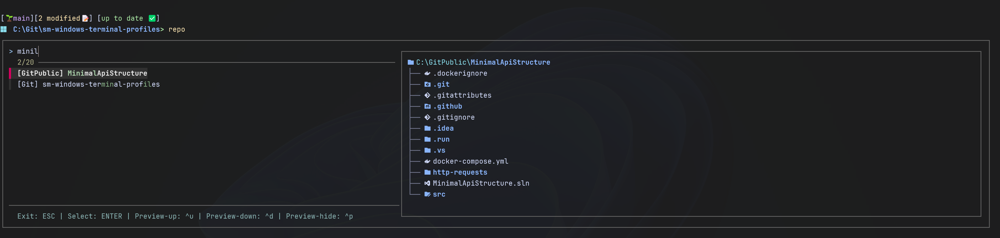
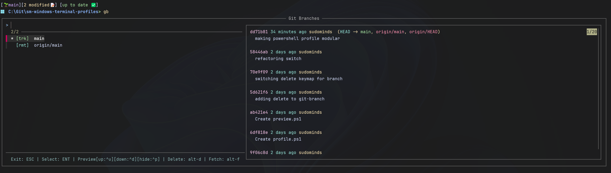
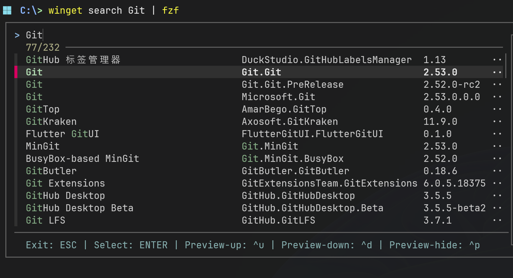
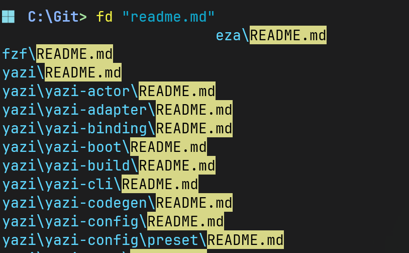
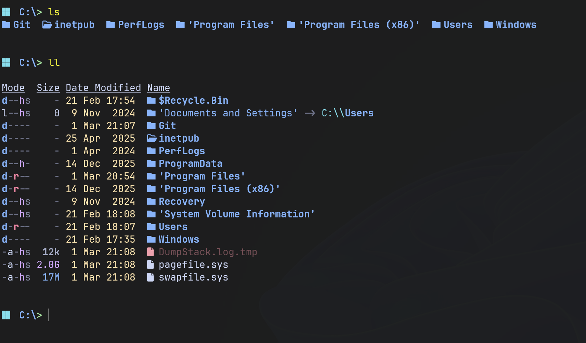
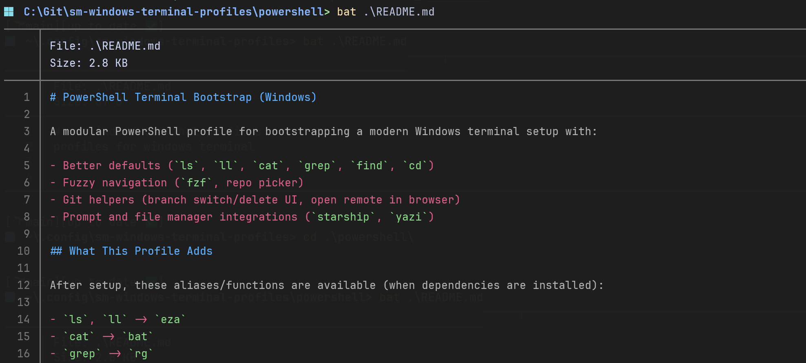
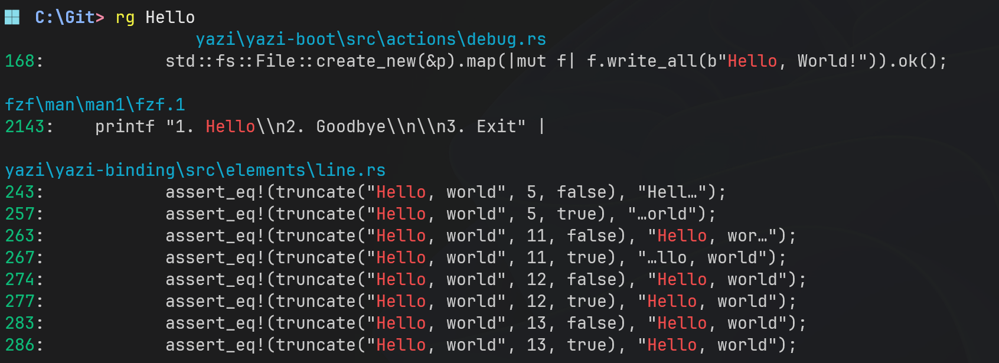
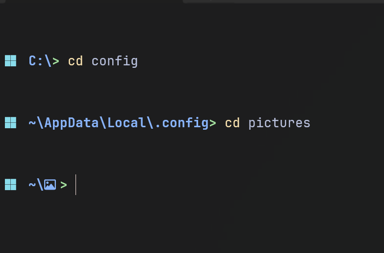
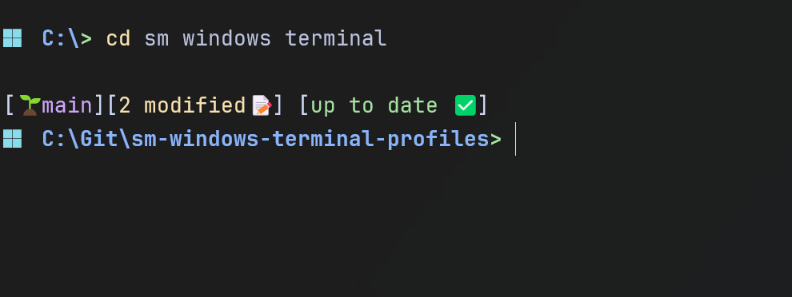
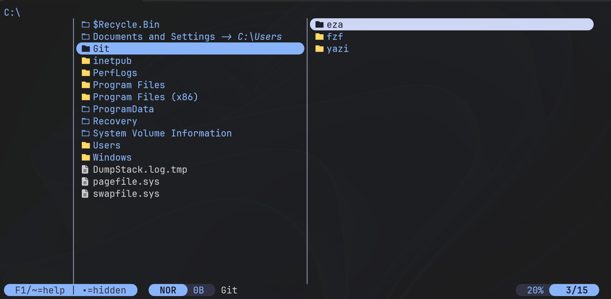

# sm-windows-terminal-profiles

Windows Terminal / PowerShell profile setup with custom functions and tool modules.

Full profile docs: [powershell/README.md](./powershell/README.md)

## Functions

### `repo`
Fuzzy-find git repositories and jump to the selected repo directory.

Source: [powershell/profile/functions/repo.ps1](./powershell/profile/functions/repo.ps1)

### `git-branch` (`gb`)
Interactive branch switch/delete/fetch workflow with preview and local/remote branch status.

Source: [powershell/profile/functions/git-branch.ps1](./powershell/profile/functions/git-branch.ps1)

## Modules

### `fzf`
Fuzzy finder integration for files, history, and interactive pickers.

GitHub: https://github.com/junegunn/fzf

### `fd`
Fast modern replacement for `find`, used for repository and file discovery.

GitHub: https://github.com/sharkdp/fd

### `eza`
Modern `ls` replacement with icons and better defaults.

GitHub: https://github.com/eza-community/eza

### `bat`
Syntax-highlighted `cat` replacement used in previews and file output.

GitHub: https://github.com/sharkdp/bat

### `ripgrep`
Fast recursive search integration (used as `grep` replacement).

GitHub: https://github.com/BurntSushi/ripgrep

### `zoxide`
Smarter directory navigation integrated with `cd`.

GitHub: https://github.com/ajeetdsouza/zoxide

### `starship`
Cross-shell prompt configuration for PowerShell.

GitHub: https://github.com/starship/starship

### `yazi`
Terminal file manager integration with cwd handoff back to PowerShell.

GitHub: https://github.com/sxyazi/yazi

